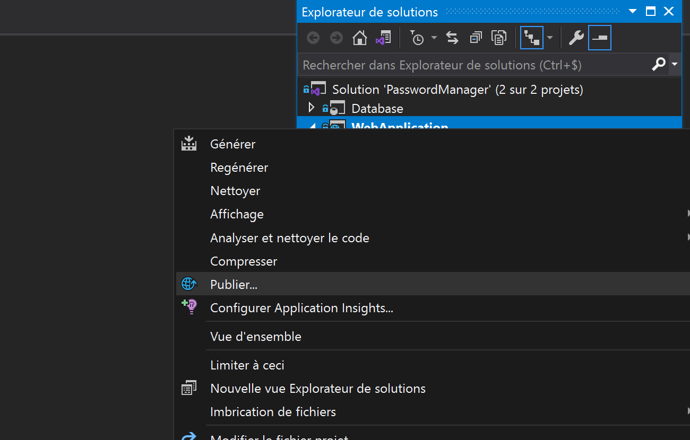

# How to Deploy PasswordManager with IIS ?

## Start PasswordManager.sln

- Right click on WebApplication --> Click Publish

- Click on Publish to deploy solution in local

* If you have an error install .NET Hosting Bundle
