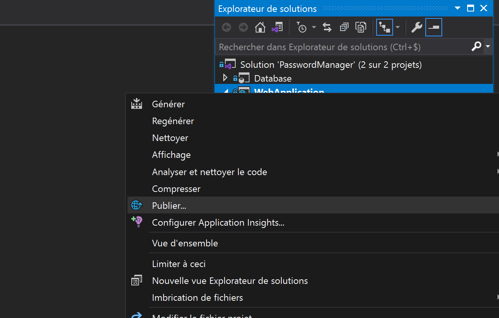

# How to Deploy PasswordManager with IIS ?

## Start PasswordManager.sln (Start Visual Studio in Administrator mode)

- Open PasswordManager/PasswordManager.sln
- Right click on WebApplication --> Click Publish

- Click on Publish to deploy solution in local

* If you have an error install [.NET Core Hosting Bundle](https://docs.microsoft.com/en-us/aspnet/core/host-and-deploy/iis/?view=aspnetcore-3.1#install-the-net-core-hosting-bundle)

* Link to the GitHub : https://github.com/7Kenz/PasswordManager/
